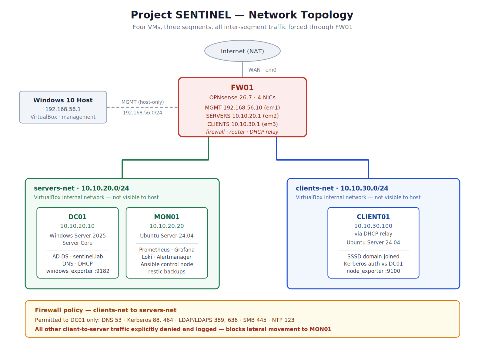
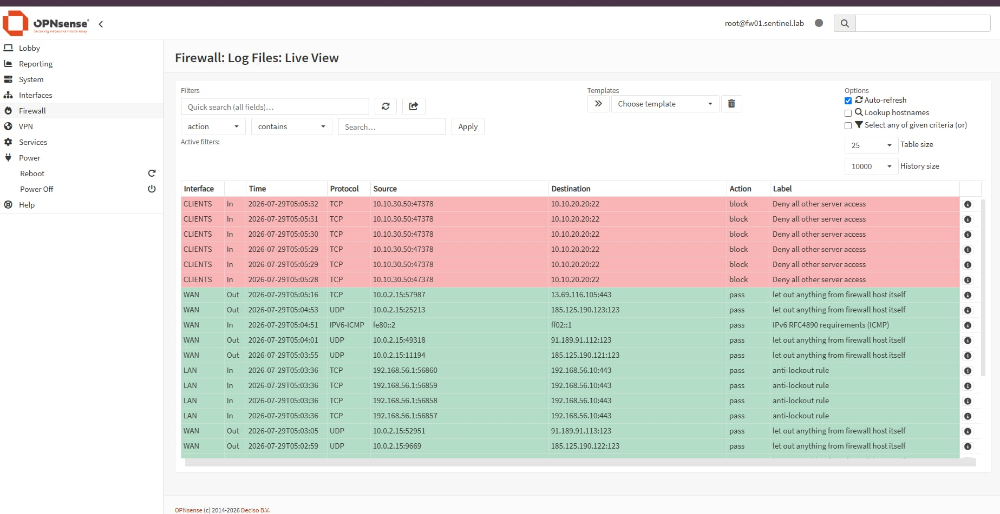
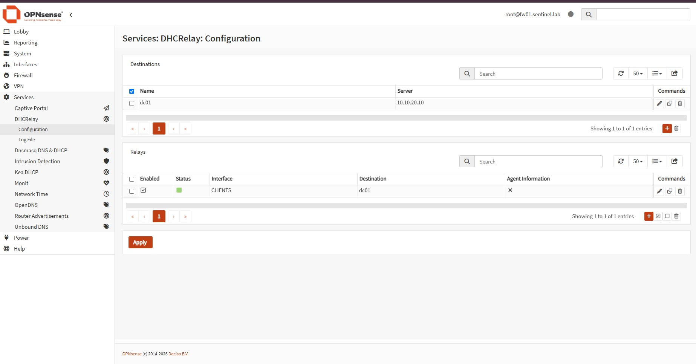
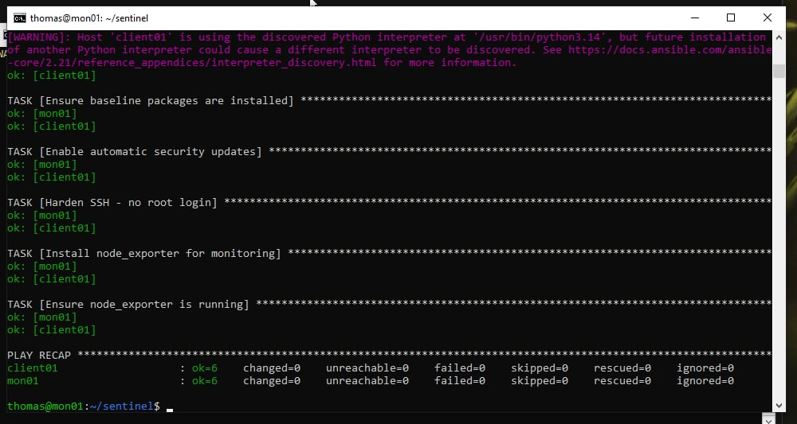
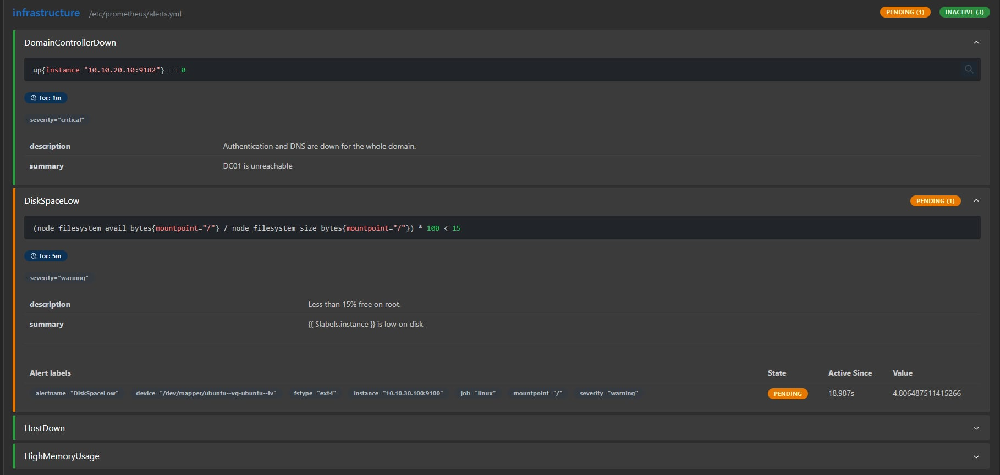
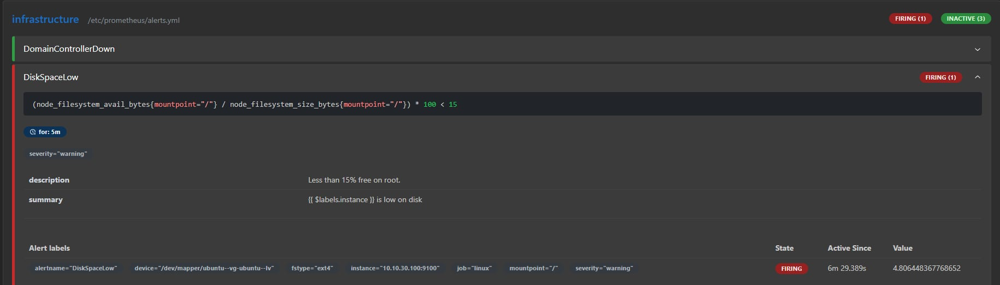
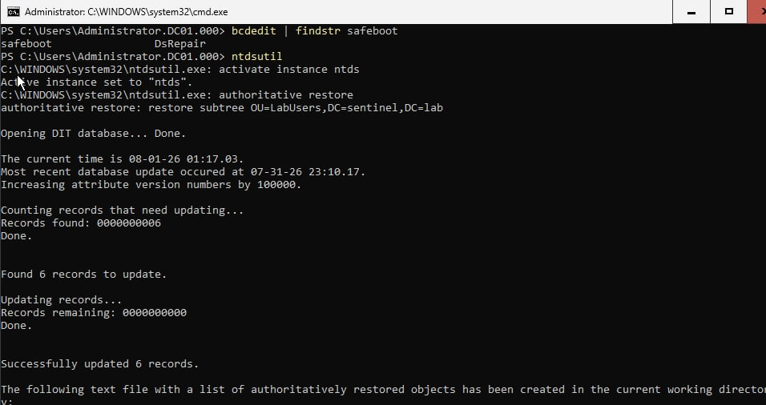
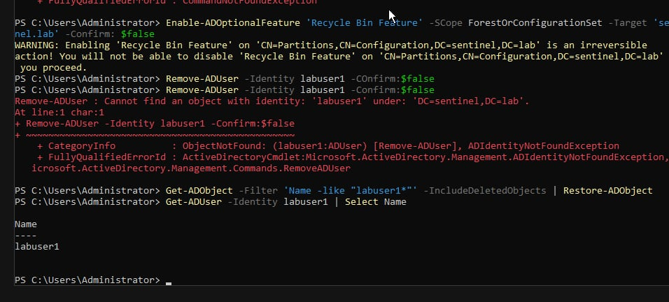

# Project SENTINEL

A segmented small-business network built from scratch on VirtualBox: four VMs, three network
segments, a firewall enforcing least-privilege between them, hybrid Windows/Linux identity,
monitoring with alerts proven end to end, and a disaster recovery drill in which an entire
Active Directory OU was deleted and recovered through an authoritative restore.

Everything above the base OS install is configured through Ansible, so the environment can be
wiped and rebuilt from this repository.



---

## The environment

| Host | OS | Address | Role |
|---|---|---|---|
| FW01 | OPNsense 26.7 | 192.168.56.10 (MGMT), .1 on both internal nets | Firewall, router, DHCP relay |
| DC01 | Windows Server 2025 Core | 10.10.20.10 | AD DS (`sentinel.lab`), DNS, DHCP |
| MON01 | Ubuntu Server 24.04 LTS | 10.10.20.20 | Prometheus, Grafana, Loki, Alertmanager, Ansible control, restic |
| CLIENT01 | Ubuntu Server 24.04 LTS | 10.10.30.100 (DHCP) | SSSD domain-joined workstation |

| Segment | Subnet | Purpose |
|---|---|---|
| MGMT (host-only) | 192.168.56.0/24 | Administrative access from the physical host |
| servers-net (internal) | 10.10.20.0/24 | Domain controller and monitoring |
| clients-net (internal) | 10.10.30.0/24 | End-user workstations |

Both internal segments are VirtualBox *internal* networks, invisible to the host. Traffic between
CLIENT01 and DC01 has no path except through FW01, so the firewall rules are load-bearing rather
than decorative.

DC01 is deployed as **Server Core** — no GUI. Every step of the forest build, DNS, DHCP, WinRM,
backup, and recovery was performed from PowerShell.

Total footprint: 7 GB RAM, ~108 GB disk.

---

## 1. Network segmentation with least-privilege rules

CLIENT01 is permitted exactly six things on the server segment — DNS, Kerberos, LDAP/LDAPS, SMB,
and NTP — enough to function as a domain member and nothing more. An explicit deny sits above the
general internet-allow rule, so any other attempt to reach servers-net is dropped and logged.



*OPNsense live firewall log. Repeated TCP attempts from the client segment to port 22 on MON01
(10.10.20.20) are dropped on the CLIENTS interface, each matching the rule labelled "Deny all
other server access". The permitted traffic below it — NTP, the management interface, the
firewall's own outbound — passes normally.*

The connection does not refuse; it hangs and times out, because the packet is silently discarded
rather than rejected. A timeout alone only shows that something failed. The log entry shows
*which rule* failed it, and that is the difference between a screenshot and evidence.

The practical effect: a compromised workstation cannot scan the server segment, cannot reach
MON01, and cannot pivot to any service that was not explicitly authorised. Flat networks — where
a single compromised laptop can reach every server — are how organisations get thoroughly owned
rather than mildly inconvenienced.

Full rule table and rationale: [docs/03-firewall-rules.md](docs/03-firewall-rules.md)

---

## 2. DHCP across a routed boundary

DHCP discovery is a broadcast, and broadcasts are not forwarded by routers. CLIENT01 sits on
clients-net; the DHCP server lives on DC01, one segment away, behind the firewall.



*The relay on FW01: a destination pointing at dc01 (10.10.20.10), and an enabled relay bound to
the CLIENTS interface. Broadcasts arriving on clients-net are forwarded to the domain controller
as ordinary unicast, and the reply is relayed back.*

No additional firewall rule is needed — the relayed traffic originates from the firewall itself
and the response is handled by the state table.

This is the same mechanism that lets a single central DHCP server address every site in a
multi-site corporate network.

---

## 3. Hybrid identity

CLIENT01 is a Linux machine that authenticates its users out of Active Directory via SSSD and
Kerberos. `id labuser1@sentinel.lab` on Ubuntu returns a UID and group memberships sourced from a
Windows domain controller.

Real environments are mixed. Identity is what ties them together — a point the DR drill below
demonstrated in an unwelcome way.

---

## 4. Configuration as code

Base OS installs were done once by hand and snapshotted. Every configuration item above that —
package baselines, SSH hardening, unattended security updates, node_exporter deployment, AD user
objects — lives in `ansible/playbooks/site.yml`.



*Second consecutive run of the same playbook against both Linux hosts. Every task reports `ok`,
and the recap shows `ok=6 changed=0` for client01 and mon01 alike.*

That output is the point. The playbook describes a desired state rather than a list of commands,
so running it against an already-correct machine does nothing. This is what makes "rebuild from
the repo" a real claim rather than an aspiration.

---

## 5. Monitoring with alerts proven end to end

Prometheus scrapes three targets and evaluates the alert rules; Grafana visualises; Alertmanager
handles routing. The alerts were tested through a full lifecycle, not merely configured.

`DiskSpaceLow` was proven by filling CLIENT01's root filesystem with a 17 GB file:



*Threshold crossed. Root filesystem on 10.10.30.100 is at 4.8% free against a 15% threshold, and
the alert enters PENDING after 18 seconds. It has not fired yet.*



*Six and a half minutes later, the condition has persisted past the `for: 5m` window and the alert
is FIRING — at which point Alertmanager receives it. Removing the file returned it to inactive.*

The `for: 5m` delay is deliberate. A filesystem that momentarily dips below a threshold should not
wake anyone at 3 AM. PENDING is the window in which a transient spike disqualifies itself, and it
is the difference between an alert people act on and an alert people learn to ignore.

---

## 6. Backups, and two restores that were actually performed

- **Linux** — restic to a dedicated second disk mounted at `/backup`, nightly via cron, with
  `--keep-daily 7 --keep-weekly 4` retention and an integrity check after each run.
- **Windows** — `wbadmin` system state backup, which includes the entire AD database, to a
  dedicated 30 GB volume.

In both cases the backup target is a separate disk from the one being protected. A backup living
on the disk it protects dies with that disk.

### The scenario

An administrator deletes the `LabUsers` OU containing all five user accounts. Logins fail across
both Windows and Linux. `Get-ADUser` against the OU returns *directory object not found*, and on
CLIENT01 `id labuser1` reports *no such user* — a Windows deletion breaking authentication on a
Linux machine.

### The hard way: DSRM authoritative restore



*Booted into Directory Services Restore Mode (`safeboot DsRepair` confirmed at the top), after the
system state recovery has completed. `ntdsutil` marks the restored subtree authoritative: six
records found and updated — the five user accounts plus the OU itself — with attribute version
numbers incremented by 100,000.*

Restoring the database alone is not sufficient. Active Directory versions every change, and a
deletion is a change. Without the authoritative step, the restored objects can be treated as
stale and the deletion re-applied — which is precisely what happens in a multi-DC environment
when the deletion replicates back from a peer. That version-number increment is the mechanism
that makes the restore win.

Total recovery time: roughly 35 minutes, plus one failed attempt (see *What I learned*).

### The easy way: AD Recycle Bin



*The same class of failure, recovered in one command. `Restore-ADObject` returns the deleted user
directly from the running directory.*

The Recycle Bin is a one-time, irreversible, forest-wide switch. It covers every object
automatically, needs no maintenance, and keeps deleted objects recoverable for 180 days. It is
also **not retroactive** — enabling it after a deletion does not help with that deletion.

Both paths are documented because the deciding factor is not how many objects were lost. It is
whether the Recycle Bin was enabled beforehand. Knowing the DSRM procedure matters because you
will eventually inherit an environment where nobody turned it on.

Full procedure: [docs/DR-RUNBOOK.md](docs/DR-RUNBOOK.md)

---

## Repository layout

```
sentinel-lab/
├── README.md
├── .gitignore
├── docs/
│   ├── 01-network-design.md
│   ├── 03-firewall-rules.md
│   ├── DR-RUNBOOK.md
│   └── images/
├── ansible/
│   ├── inventory/hosts.yml
│   ├── group_vars/
│   └── playbooks/site.yml
├── monitoring/
│   ├── docker-compose.yml
│   ├── prometheus.yml
│   └── alerts.yml
└── scripts/
    └── backup.sh
```

---

## What I learned

---

## Known limitations

- **MON01 triples as monitoring host, Ansible control node, and backup repository.** In a real
  deployment these would be separate systems; they are combined here because the whole lab runs
  in 16 GB of RAM. The backup repository in particular should not live on the machine that
  monitors the things being backed up.
- **WinRM runs unencrypted over HTTP (5985).** Acceptable only because the segment is isolated
  and the traffic never leaves the host. Production would use HTTPS on 5986 with a certificate,
  or Kerberos authentication.
- **A single domain controller.** Replication, FSMO role transfer, and multi-DC restore semantics
  are untested. The authoritative restore step is included precisely because it is what a
  multi-DC environment requires — but this lab cannot demonstrate the replication that makes it
  necessary.
- **Monitoring detects infrastructure failure, not logical data loss.** Deleting an entire OU
  triggered no alert, because there is no metric for it. Closing that gap means shipping
  Directory Service event logs to Loki and alerting on event ID 5141.
- **SSSD is configured for fully-qualified login names** (`labuser1@sentinel.lab`). Short-name
  login would require `use_fully_qualified_names = False`; the explicit form was kept as it
  disambiguates in multi-domain environments.
- **The Windows Exporter Grafana dashboard is partially unpopulated.** Several panels expect
  metric names this exporter build does not publish. Host metrics are collected and alertable —
  `DomainControllerDown` evaluates against the same target — but the imported community dashboard
  would need its queries adjusted to display them.
- **No configuration backup for OPNsense.** Firewall rules are documented but not exported to the
  repository, so a rebuild of FW01 is currently manual.

---

## Rebuilding from this repository

1. Restore each VM to its base snapshot (`base-configured`, `dc-promoted`, `mon01-base`).
2. From MON01: `ansible-playbook -i inventory/hosts.yml playbooks/site.yml --ask-vault-pass`
3. `cd monitoring && docker compose up -d`

Credentials are stored in an Ansible Vault file. No plaintext secrets are committed.
